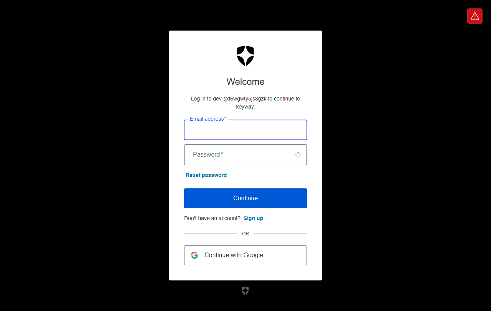
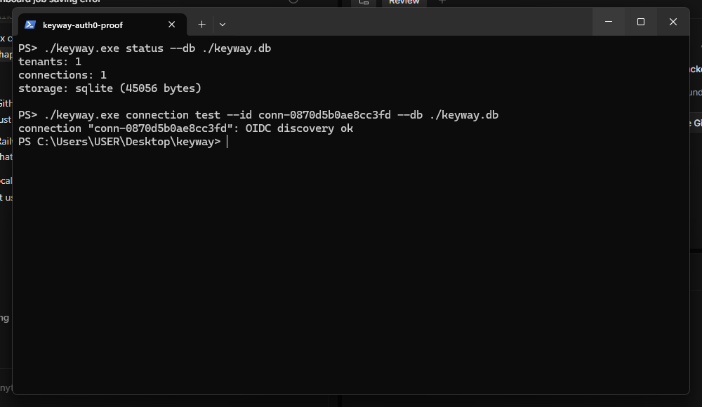

# Keyway — self-hosted Enterprise SSO connector for Go

One OAuth2-style flow in your app. SAML or OIDC on the other end. Your
customer's IdP, your binary: a single static Go binary, SQLite by default,
zero required infrastructure.

## 10-minute quickstart

```sh
go build -o keyway ./cmd/keyway

# 1. Master key for sealed OIDC secrets (hex, 32 bytes).
export KEYWAY_MASTER_KEY="$(./keyway keygen)"

# 2. Start (localhost only by default).
./keyway start --db ./keyway.db --base-url http://127.0.0.1:8080 &
# Uses an ephemeral SP identity; pass --sp-key/--sp-cert files for a stable one.

# 3. Register your customer's SSO.
./keyway tenant create --id acme --name Acme \
  --redirect-uris http://localhost:3000/callback

# OIDC (Auth0 / Google / Azure AD test app):
./keyway connection add --tenant acme --type oidc \
  --issuer https://YOUR-TENANT.us.auth0.com/ \
  --client-id CLIENT_ID --client-secret CLIENT_SECRET \
  --email-claim email --name-claim name

# ..or SAML (Okta developer org: copy the IdP metadata XML to a file):
./keyway connection add --tenant acme --type saml \
  --metadata ./acme-okta.xml \
  --email-claim http://schemas.xmlsoap.org/ws/2005/05/identity/claims/emailaddress \
  --name-claim http://schemas.xmlsoap.org/ws/2005/05/identity/claims/name

# 4. Dry-run before going live (SAML needs the server's SP flags).
./keyway connection test --id conn-<id> \
  --sp-entity-id http://127.0.0.1:8080/sp \
  --sp-acs-url http://127.0.0.1:8080/callback/saml/conn-<id> \
  --sp-key ./sp.key --sp-cert ./sp.crt

# Approve the tested connection for logins (untested logins are refused).
./keyway connection activate --id conn-<id>

# 5. Log in: open the authorize URL, follow the IdP redirect, land back
#    on your app with ?code=...&state=....
http://127.0.0.1:8080/authorize?tenant=acme&redirect_uri=http://localhost:3000/callback&state=app-123

# 6. Exchange the single-use code (60s) for the normalized identity.
curl -X POST http://127.0.0.1:8080/token \
  -d code=... -d redirect_uri=http://localhost:3000/callback
# {"email":"ada@example.com","name":"Ada","groups":["eng"]}
```

## Commands

| Command | Purpose |
|---|---|
| `keyway start` | Serve flow + admin API (`--addr`, `--db`, `--base-url`, `--sp-entity-id`, `--sp-key`, `--sp-cert`) |
| `keyway keygen` | Print a fresh master key for `KEYWAY_MASTER_KEY` |
| `keyway tenant create\|list` | Provision and inspect customers |
| `keyway connection add\|list\|delete\|test\|activate` | Register, inspect, remove, dry-run, approve IdPs |
| `keyway status` | Tenant/connection counts and DB size |

Admin API mirrors the CLI at `/admin/*` (tenants, connections, `POST
/admin/connections/{id}/test`). Connection responses never include secrets.

## Tested with Auth0

End-to-end login verified Sep 2026 against an Auth0 EU dev tenant:
OIDC discovery, `/authorize` redirect, hosted login, callback, and
`POST /token` returning the normalized identity.

```sh
./keyway status --db ./keyway.db
# tenants: 1
# connections: 1
# storage: sqlite (45056 bytes)

./keyway connection test --id conn-<id> --db ./keyway.db
# connection "conn-<id>": OIDC discovery ok
```





## Security notes

- SAML signatures verified against IdP metadata on every response;
  unsigned assertions rejected. OIDC ID tokens verified (issuer, audience,
  expiry, signature) plus a strict nonce check.
- Authorization codes: 60s, single-use, `redirect_uri`-bound.
- OIDC secrets sealed at rest (AES-256-GCM); no key rotation in v1.
- `redirect_uri` allowlisted per tenant; login outcomes logged, assertions
  and tokens never logged.
- Admin API has no token in v1 — it binds localhost by default; do not
  expose it beyond loopback without a proxy in front.
- Stable SP identity: generate `sp.key`/`sp.crt` once per deployment and
  pass `--sp-key`/`--sp-cert` to `keyway start`; without them the server
  mints an ephemeral identity on every boot. Keep the key `0600` and out
  of version control.

## Layout

`internal/oidc`, `internal/saml` (only protocol-aware code) →
`internal/normalize` (`Identity`) → `internal/flow` (orchestration) →
`internal/api` (HTTP) → `internal/storage` (SQLite) → `cmd/keyway`.
`internal/secret` seals credentials; `internal/cli` drives the binary.
